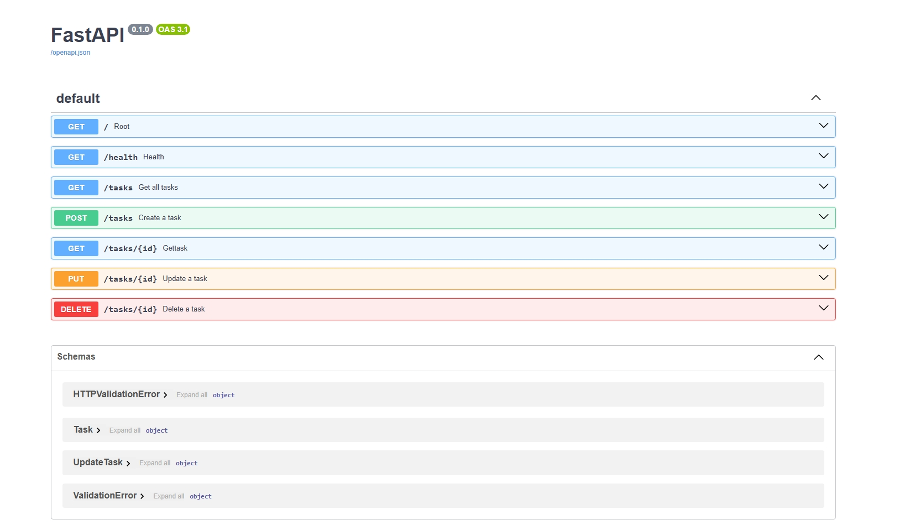

# Task API

A simple CRUD API built with FastAPI.

## Features

- Create tasks
- Read all tasks
- Read a task by ID
- Update tasks
- Delete tasks
- Interactive Swagger documentation

## Run the project

```bash
uvicorn main:app --reload
```

Open:

```
http://127.0.0.1:8000/docs
```

## Swagger UI

